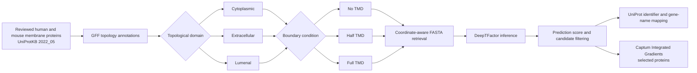

[](LICENSE-CC-BY)
[](tf_running_captum.py)
[](#limitations)

**Topology-aware deep-learning screening of mammalian membrane-protein domains for transcription-factor-like sequence features.**

This repository contains the code, processed inputs, intermediate files, and prediction outputs generated for the analysis **“Prediction of novel mammalian membrane transcription factors using deep learning.”**

The workflow uses reviewed human and mouse membrane proteins from **UniProtKB 2022_05**, separates their annotated **cytoplasmic, extracellular, and lumenal domains**, and evaluates alternative domain boundaries containing no, half, or all of the adjacent transmembrane domain. The resulting protein fragments are classified with [DeepTFactor](https://bitbucket.org/kaistsystemsbiology/deeptfactor), while selected predictions are interpreted at amino-acid resolution with [Captum Integrated Gradients](https://captum.ai/api/integrated_gradients.html).

> **Repository scope:** this is a research-analysis archive rather than a packaged command-line application. It preserves the original data organization and commands needed to understand or reproduce the analysis.


## Scientific question

The analysis asks two related questions:

1. Which annotated domains of reviewed mammalian membrane proteins contain sequence patterns classified as transcription-factor-like by DeepTFactor?
2. How sensitive are those predictions to the amount of the adjacent transmembrane domain included in the input sequence?

To test the second question, each eligible topological domain was assessed under three sequence-boundary conditions:

| Condition | Repository naming | Sequence submitted to DeepTFactor |
|---|---|---|
| No TMD | `*_no_transmembrane` or the unmodified domain folder | Annotated topological domain only |
| Half TMD | `*_transmembrane_+12` | Domain extended by approximately half of each adjacent annotated TMD |
| Full TMD | `*_full_transmembrane` or `*_extracellular_full` / `*_lumenal_full` | Domain extended across the complete adjacent annotated TMD |

For multi-pass proteins, the AWK scripts generate the corresponding combinations for domains flanked by two transmembrane segments.

## Data source

The original analysis used **UniProtKB release 2022_05**.

Reviewed membrane-protein queries:

```text
(organism_id:9606) AND (reviewed:true) AND (keyword:KW-0472)   # human: 7,663 proteins
(organism_id:10090) AND (reviewed:true) AND (keyword:KW-0472)  # mouse: 6,527 proteins
```

Topology-specific queries:

```text
# Cytoplasmic domains
(organism_id:9606) AND (reviewed:true) AND (ft_topo_dom:cytoplasmic)
(organism_id:10090) AND (reviewed:true) AND (ft_topo_dom:cytoplasmic)

# Extracellular domains
(organism_id:9606) AND (reviewed:true) AND (ft_topo_dom:extracellular)
(organism_id:10090) AND (reviewed:true) AND (ft_topo_dom:extracellular)

# Lumenal domains
(organism_id:9606) AND (reviewed:true) AND (ft_topo_dom:lumenal)
(organism_id:10090) AND (reviewed:true) AND (ft_topo_dom:lumenal)
```

The GFF topology annotations were downloaded from UniProtKB, processed with `grep` and the domain-specific AWK scripts, and converted into coordinate-aware UniProt identifiers for sequence retrieval.

## Analysis workflow



## Repository structure

```text
MTF_prediction/
├── cytoplasmic/
│   ├── human_no_transmembrane/
│   ├── human_transmembrane_+12/
│   ├── human_full_transmembrane/
│   ├── mouse_no_transmembrane/
│   ├── mouse_transmembrane_+12/
│   └── mouse_full_transmembrane/
├── extracellular/
│   ├── human_extracellular/
│   ├── human_extracellular_+12/
│   ├── human_extracellular_full/
│   ├── mouse_extracellular/
│   ├── mouse_extracellular_+12/
│   └── mouse_extracellular_full/
├── lumenal/
│   ├── human_lumenal/
│   ├── human_lumenal_+12/
│   ├── human_lumenal_full/
│   ├── mouse_lumenal/
│   ├── mouse_lumenal_+12/
│   └── mouse_lumenal_full/
├── result_captum/
│   ├── result_ATF6A/
│   ├── result_ATF6B/
│   ├── result_CREB3/
│   ├── result_JPH2/
│   ├── result_MYRF/
│   ├── result_PLSCR1/
│   ├── result_PLSCR2/
│   ├── result_SREBF1/
│   ├── result_SREBF2/
│   └── result_XBP1/
├── tf_running_captum.py
├── workflow.txt
├── Figure_1.png
├── CITATION.cff
└── LICENSE-CC-BY
```

Each organism/domain/condition directory contains the relevant inputs, coordinate transformations, sequence files, and prediction outputs.

## File conventions

| File pattern | Role |
|---|---|
| `*.gff` | UniProtKB topology annotations used as the primary input |
| `*_filtered.gff` | Selected topological domains, optionally extended into adjacent TMDs |
| `*_filtered_IDs.csv` | UniProt accessions with residue coordinates for sequence retrieval |
| `*.fasta` | Protein fragments submitted to DeepTFactor |
| `half_*.awk` | Extends a domain by half of each adjacent TMD |
| `full_*.awk` | Extends a domain across each complete adjacent TMD |
| `result/prediction_result.txt` | DeepTFactor classification and score for every sequence |
| `*_true.csv` | Positively classified fragments, generally sorted by score |
| `uniprot_names.csv` | Accessions prepared for UniProt ID mapping or gene-name retrieval |
| `*.ods` | Manually inspected or curated result tables |
| `result_captum/table_*.csv` | Residue-level Integrated Gradients attribution values |
| `result_captum/fig2_*.png` | Sequence-logo visualization of attribution values |

## Requirements

The original analysis depends on:

- Linux or another Unix-like environment
- GNU `awk`, `grep`, `sort`, and `cut`
- Conda or Miniconda
- [DeepTFactor](https://bitbucket.org/kaistsystemsbiology/deeptfactor)
- Python with:
  - PyTorch
  - NumPy
  - pandas
  - Captum
  - Logomaker
  - Matplotlib / `pylab`

DeepTFactor supplies the model implementation, argument parser, data loader, and trained checkpoint expected by `tf_running_captum.py`.

The repository does not currently provide a locked environment file. For the closest reproduction of the original analysis, create the environment supplied by the DeepTFactor project and then add the interpretation dependencies:

```bash
git clone https://bitbucket.org/kaistsystemsbiology/deeptfactor.git
cd deeptfactor

conda env create -f environment.yml
conda activate deeptfactor

python -m pip install captum pandas numpy logomaker matplotlib
```

Use PyTorch and CUDA versions compatible with the selected DeepTFactor environment and your hardware.

## Reproducing the analysis

### 1. Download topology annotations

Run the relevant UniProtKB query, export the results in **GFF** format, and save the file in the appropriate organism/domain/condition directory.

Example for cytoplasmic annotations:

```bash
grep "Cytoplasmic" cytoplasmic.gff > cytoplasmic_filtered.gff
```

### 2. Generate alternative domain boundaries

For the half-TMD condition:

```bash
awk -f half_cytoplasmic.awk cytoplasmic.gff > cytoplasmic_filtered.gff
```

For the full-TMD condition:

```bash
awk -f full_cytoplasmic.awk cytoplasmic.gff > cytoplasmic_filtered.gff
```

Equivalent scripts are provided for extracellular and lumenal domains.

### 3. Create coordinate-aware identifiers

```bash
awk -F "\t" '{print $1"["$4"-"$5"]"}' \
  cytoplasmic_filtered.gff \
  > cytoplasmic_filtered_IDs.csv
```

Use the resulting accessions and coordinates with UniProt **Retrieve/ID mapping** to download the corresponding fragments in FASTA format.

### 4. Run DeepTFactor

From an activated DeepTFactor environment:

```bash
python /path/to/deeptfactor/tf_running.py \
  -i cytoplasmic.fasta \
  -g cuda \
  -o result
```

Use `cpu` instead of `cuda` when a compatible GPU is unavailable.

DeepTFactor writes:

```text
sequence_ID    prediction    score
```

The prediction threshold used by the accompanying script is **0.5**.

### 5. Extract positive predictions

```bash
{
  head -n 1 result/prediction_result.txt
  grep -P '\tTrue\t' result/prediction_result.txt \
    | sort -t $'\t' -k3,3nr
} > result/cytoplasmic_true.csv
```

The UniProt accessions can then be prepared for ID mapping:

```bash
awk 'NR > 1 {print $1}' result/cytoplasmic_true.csv \
  | cut -c 4- \
  | cut -f1 -d"|" \
  > result/uniprot_names.csv
```

### 6. Calculate Integrated Gradients

`tf_running_captum.py` extends the DeepTFactor inference script with Captum Integrated Gradients. It writes the standard prediction table to the selected output directory and produces residue-attribution tables and sequence-logo figures in the current working directory.

Run it from the directory where the interpretation files should be created:

```bash
mkdir -p result_captum/result_EXAMPLE
cd result_captum/result_EXAMPLE

python ../../tf_running_captum.py \
  -i /path/to/EXAMPLE.fasta \
  -g cpu \
  -o .
```

Expected interpretation outputs include:

```text
prediction_result.txt
table_0.csv
fig2_0.png
```

For FASTA files containing several sequences, the numeric suffix identifies the sequence order in the input file.

## Interpretation of the outputs

A positive DeepTFactor result indicates that the submitted protein fragment contains sequence features that the model associates with transcription factors. It should be treated as a **candidate-generating prediction**, not as evidence that the full membrane protein functions as a transcription factor in vivo.

The Integrated Gradients outputs provide model-attribution scores for amino-acid identities at each sequence position. They can help identify which residues or regions influenced a prediction, but they do not independently establish a DNA-binding domain, nuclear localization, proteolytic activation mechanism, or transcriptional function.

## Limitations

- Predictions are computational hypotheses and require orthogonal biological validation.
- Results are tied to **UniProtKB 2022_05**, the selected DeepTFactor checkpoint, and the preprocessing rules used here.
- The prediction cutoff is fixed at `0.5` in `tf_running_captum.py`.
- Protein fragments longer than **1,000 amino acids** were excluded in the original workflow because of the model/input limitation used at the time.
- Some identifiers containing non-standard amino-acid symbols were inspected separately.
- UniProt sequence retrieval, gene-name mapping, and duplicate resolution include manual steps.
- The repository does not yet include an automated end-to-end workflow, dependency lock file, continuous integration, or regression tests.
- The original DeepTFactor model was developed for general transcription-factor prediction; performance on isolated mammalian membrane-protein domains should therefore be interpreted cautiously.

## Citation

When using this repository, cite:

> Soler, R., and Borrell, V. (2023). *Prediction of novel mammalian membrane transcription factors using deep learning* [Software]. GitHub: https://github.com/rsolerortuno/MTF_prediction

The repository also includes a machine-readable [`CITATION.cff`](CITATION.cff) file.

Please also cite DeepTFactor:

> Kim, G. B., Gao, Y., Palsson, B. O., and Lee, S. Y. (2021). DeepTFactor: A deep learning-based tool for the prediction of transcription factors. *Proceedings of the National Academy of Sciences*, 118(2), e2021171118. https://doi.org/10.1073/pnas.2021171118

For model interpretation, cite Captum and/or the Integrated Gradients method as appropriate.

## Authors

- **Rafael Soler** — [ORCID: 0000-0003-1245-5734](https://orcid.org/0000-0003-1245-5734)
- **Víctor Borrell** — [ORCID: 0000-0002-7833-3978](https://orcid.org/0000-0002-7833-3978)

## License

This work is distributed under the [Creative Commons Attribution 4.0 International License](LICENSE-CC-BY).
